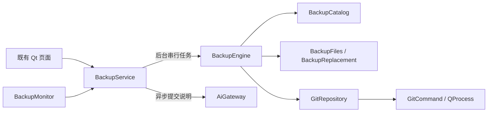

# 备份核心

ZcVersionBox 为选定的普通文件或文件夹建立独立同步副本，再把副本作为普通 Git 工作仓库管理。源位置不需要初始化 Git。备份、预览、pull 和 push 不写源；只有恢复、导入，以及明确应用拉取版本，才会修改源内容。

## 职责与依赖



| 模块 | 职责 |
| --- | --- |
| `utils/backupservice.*` | 应用级串行队列、工作线程、任务 ID、取消、异步完成、AI 等待、内存快照和通知 |
| `utils/backup_engine.*` | 仅在工作线程执行的添加、备份、恢复、远程同步、分歧解决、导入、删除和重建用例 |
| `utils/backup_catalog.*` | UUID、路径映射、仓库代次、持久状态、成功基线和未完成标记；QSaveFile 原子保存 |
| `utils/backup_git.*` | 普通 Git 命令、完整提交身份、历史/Diff、实际分支与 upstream、detached worktree 导出 |
| `utils/gitcommand.*` | 进程、二进制输出、错误、超时、取消；去除会重定向 Git 存储的继承环境变量 |
| `utils/backup_files.*` | 观察/复制策略、指纹、候选副本、同卷替换、回滚与路径安全 |
| `utils/backupmonitor.*` | 1.5 秒周期、请求合并、失败退避和条目目录监控；只向服务申请操作 |
| `utils/backup_types.h` | 与 UI 无关的状态、记录、版本、导入选择、恢复确认和强类型结果 |
| `utils/backup_dependencies.h` | 注入 Git、文件操作、保存、UUID 和 AI 超时，供隔离故障测试使用 |

服务不依赖窗口、Designer、展示模型或 Qlementine。耗时接口返回 `BackupTaskId`，以 `BackupResult<T>` 或 `OperationResult` 完成。列表、路径、代次和状态来自内存快照，不运行 Git。页面绑定对象 ID、仓库代次和请求代次，丢弃过期结果；恢复与 pull 解决还校验确认时的源内容。

AI 提交说明异步请求，默认 15 秒超时后使用普通自动说明。等待期间 UI 事件循环保持响应，当前备份仍占有串行队列与进程锁。生产代码没有嵌套事件循环等待 AI，也没有第二条写仓库的通道。

## 存储与身份

默认位置仍为系统“文档”目录下的 `ZcVersionBox/Backup`，设置仍为旁边的 `config.ini`。

```text
Backup/
  .writer.lock
  items/<uuid>/
    record.json
    repository/.git/
    repository/<受管理内容>
  staging/
```

JSON 记录使用 `format: 1`，保存 `sourcePath`、`repositoryPath`、`directory`、`generation`、`state`、`lastCommit`、`fingerprint`、`pendingCommit`、`operation`、`recoveryPaths`。仓库内路径是相对路径，整个仓库用 `.`。本地添加通常映射为源的文件名或目录名；导入保留原提交路径，本地目标改名不改变映射。

UUID 随机生成，不再把源路径编码为目录名。完整 OID 用于业务身份，短哈希只展示。`lastCommit` 是最后确认的仓库基线；`fingerprint` 仅在成功同步源内容后推进。拉取只改变非受管理路径时推进仓库基线，但不推进源指纹。

旧的百分号编码目录不会加载、自动删除或迁移。要继续使用旧仓库，可通过“从云端导入”输入旧仓库的本地路径，选择原仓库内内容及新的本地目标。无法读取的新记录会报告路径并保留数据。

## 默认文件范围

观察范围和复制范围是两个明确策略，集中在 `BackupSelectionPolicy`，没有合并成一个规则。

| 内容 | 是否触发同步 | 是否复制 | 是否进入提交 |
| --- | --- | --- | --- |
| 普通、隐藏文件 | 是 | 是 | 遵守普通 Git ignore/attributes 规则 |
| 原监控规则匹配的 `build` | 否 | 是 | 遵守 Git ignore；已追踪文件继续追踪 |
| `.git` 元数据 | 否 | 否 | 不进入同步内容；同步仓库自身的 `.git` 独立创建 |
| 符号链接、目录联接 | 不遍历 | 遇到时明确失败 | 不自动跟随到源范围外 |

`build/output.bin` 单独变化不会创建版本；普通文件变化触发备份时，新的 build 内容仍可能复制并提交。`.gitignore` 排除的文件可存在于副本，但不会被强制纳入提交。匹配方式保留原先的 `/.git/`、`/build/` 等监控规则，没有新增 Ignore 功能或 Git attributes 覆盖。

普通添加和备份使用 `git add --all`。备份提交使用 `git commit --only -- <受管理路径>`，并在暂存前后及提交后核对状态；外部暂存内容不能混入本次提交。重建有一处限定的 `--force`：输入仅为旧提交导出的完整树，用于保留“已追踪、后来匹配 ignore”的文件；替换前验证新旧树相同。它不读取或加入源中新的忽略项。

源位置与备份存储不能互相包含。选择路径和后续文件操作检查祖先链接。用户选择的路径不能是 `.git` 指针文件、元数据目录或其内部路径；添加在运行 Git 前校验仓库内路径，初始化也拒绝复用已有 `.git`。这样可避免 Git 指针把操作重定向到原仓库，或导入误删源 Git 元数据。重建仍可替换应用自有仓库的 `.git`。

恢复普通目录时按需逐项替换，保护其中任意层级的 `.git`；即使版本中没有对应目录，也保留容纳源 Git 元数据的必要目录。

## 同步状态与 pull

运行中的忙态、任务取消和以下持久业务状态分开。

| 状态 | 规则 |
| --- | --- |
| 正常追踪 | 可以根据源变化同步和提交 |
| 已拉取，源位置待处理 | 继续观察源；禁止普通备份、再次 pull、普通恢复和重建；保留源指纹和待处理 OID |
| 需要检查 | 未完成操作、失败保护无法确认或外部修改；暂停内容写入，显示原因和保留路径 |

pull 与备份串行，要求工作区和暂存区干净。使用实际分支和 upstream；没有 upstream 时使用当前分支名和默认 `origin`。fetch 后仅允许快进合并，分叉明确失败。修改仓库前先保存暂停标记，保存失败不执行 pull。

快进未改变受管理 Git 内容时恢复追踪，保留源指纹。改变内容时保存拉取后的完整 OID，源位置保持不变，进入待处理状态。即使源内容碰巧相同，也需要明确解决操作。失败且 HEAD、工作区及暂存区确认未变时恢复原状态；结果不确定时进入需要检查。

排队备份在执行时重新加载记录并检查状态。重启、源继续编辑、修改远程地址、取消确认都不解除暂停。待处理时仍可查看历史、对比、预览及推送已提交历史。

概览提供两种解决方式：

1. **将拉取版本应用到源位置**：准备确认请求，记录源存在状态、完整内容指纹、对象/仓库代次和待处理 OID；确认后再次校验，复用恢复流程。成功后同步基线，不额外提交相同内容。
2. **保留源内容并创建新版本**：同样校验确认上下文，在拉取提交之上执行普通备份。远端版本保留为祖先；无 Git 内容变化时不创建空提交。

两者都在成功落盘后才恢复追踪。远端删除映射路径、改变类型或包含不支持的链接/子模块时明确失败，不解释为允许删除源。需要检查状态的“重新检查”要求仓库干净，并要求先人工处理保留材料，不自动重放；确认仓库有新提交时仍进入待处理状态，通过明确选择解决源与仓库分歧。

## 执行与失败边界

每个任务使用存储级 `QLockFile`，正常应用与右键入口不能同时写存储；被占用时返回可重试结果。监控只监听 `items`，避免自身锁文件变化触发重载循环。失败从 1.5 秒退避到最多 60 秒，重复相同错误不反复通知。

普通备份流程：

1. 校验状态、源、干净仓库与已确认的 HEAD。
2. 在仓库外准备完整候选副本；流式复制，比较复制前后的完整指纹。观察指纹包含大小、修改时间和 SHA-256，可发现同大小、同时间的内容变化。目录枚举、读取或权限复制失败都会中止，不把无法读取的目录当作空目录提交删除。
3. 保存简单未完成标记；替换前记录原内容、候选内容及待移动条目的指纹，以同卷 rename 保留旧副本并安装候选。逐次核对移动内容，最终对照候选的预期内容验证，不能把安装后读到的任意内容当作成功基线。
4. 暂存前检查外部变化，暂存后检查路径范围；提交前后核验 HEAD、暂存区、工作区及已安装副本。提交仅包含受管理路径。成功后保存提交/源基线，通知页面，再清理旧副本。
5. 失败且确认没有外部修改或意外提交时恢复文件和暂存状态。回滚前检查已移动内容，包括保留的旧副本；部分移动失败也只能撤销已确认完成的移动。不确定时停止写入、保留材料并报告路径，不强行 reset 工作区。

提交已生成但最终记录保存失败时，保留提交、旧副本和未完成标记，暂停后续写入。提交瞬间出现外部暂存变化时也会保留它并暂停，不把它混入提交或清空。源缺失、复制失败、取消、Git 失败不推进成功基线。应用 pull 和导入的源指纹同样只在内容验证成功后赋给记录。进程中止后下次加载发现标记；干净状态与 HEAD 也在重载和写入前检查。

添加先完成候选仓库再注册。导入先完成普通 clone、选择和候选副本，在写源前持久记录未完成操作；可确认的失败恢复原目标。重建先准备新 Git 元数据，保留实际分支、对象哈希格式及远程配置，验证提交树一致、原仓库未被外部改变后替换；远端覆盖使用明确 OID 的 `force-with-lease`。删除仅清理应用拥有的条目，不删除源。

预览与恢复共享临时 detached worktree 导出，不切换实际仓库分支。最新说明编辑使用 `commit --amend --only`，不夹带现有暂存内容；历史提交不能直接编辑。

应用不维护独立 Git index、详细事务日志、崩溃重放或底层 `update-ref`。替换的移动清单和预期指纹仅在当前任务内使用。锁约束应用进程，不能阻止外部编辑器或 Git 随时修改文件；指纹和提交检查用于发现明确冲突，不提供文件系统级原子快照。持续变化的源需要稍后重试。

## 后续议题

- Ignore 的产品范围、配置与 UI 单独设计，不能借策略抽象改变默认 build 行为。
- 自动崩溃恢复独立评估；当前是保留材料、报告和人工检查。
- 大目录目前在后台周期读取指纹，后续可据实际性能数据增加增量扫描或系统监控。
- 符号链接、目录联接和 Git 子模块尚不支持；空目录等仍受普通 Git 能力约束。
- 部分路径比较目前仅区分 Windows 与其他平台，macOS 需按磁盘实际的大小写规则补齐实现与回归。
- 文件复制保留权限，但源指纹尚未包含权限；仅修改脚本可执行位不会触发自动备份，需要补充实现与跨平台测试。
- Windows 隔离测试不替代 macOS CI、真实平台集成或远程认证环境验证。
