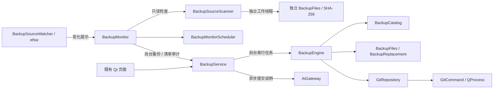

# 备份核心

ZcVersionBox 为选定的普通文件或文件夹建立独立同步副本，再把副本作为普通 Git 工作仓库管理。源位置不需要初始化 Git。备份、预览、获取云端更新和 push 不写源；只有恢复、导入，以及明确应用同步处理结果，才会修改源内容。

## 职责与依赖


```mermaid
flowchart LR
    UI[既有 Qt 页面] --> Service[BackupService]
    Watcher[BackupSourceWatcher / efsw] -->|变化提示| Monitor[BackupMonitor]
    Monitor --> Policy[BackupMonitorScheduler]
    Monitor -->|只读检查| Scanner[BackupSourceScanner]
    Scanner -->|独立工作线程| ScanFiles[独立 BackupFiles / SHA-256]
    Monitor -->|后台备份 / 清单审计| Service
    Service -->|后台串行任务| Engine[BackupEngine]
    Service -->|异步提交说明| AI[AiGateway]
    Engine --> Catalog[BackupCatalog]
    Engine --> Files[BackupFiles / BackupReplacement]
    Engine --> Git[GitRepository]
    Git --> Command[GitCommand / QProcess]
```

| 模块 | 职责 |
| --- | --- |
| `utils/backupservice.*` | 前台/后台串行队列、工作线程、任务 ID、取消、异步完成、AI 等待、版本化内存快照和加载状态 |
| `utils/backup_engine.*` | 仅在工作线程执行的添加、备份、恢复、远程同步、分歧解决、导入、删除和重建用例 |
| `utils/backup_merge.*` / `utils/backup_engine_resolution.cpp` | 独立候选仓库、逐处合并、选择持久化、预览及应用事务 |
| `utils/backup_catalog.*` | UUID、路径映射、仓库代次、持久状态、成功基线和未完成标记；QSaveFile 原子保存 |
| `utils/backup_git.*` | 普通 Git 命令、完整提交身份、历史/Diff、里程碑标记、实际分支与 upstream、detached worktree 导出 |
| `utils/gitcommand.*` | 进程、二进制输出、错误、超时、取消；去除会重定向 Git 存储的继承环境变量 |
| `utils/backup_files.*` | 观察/复制策略、指纹、候选副本、同卷替换、回滚与路径安全 |
| `utils/backupmonitor.*` | 生命周期、组件连接、后台清单/仓库审计、通知去重；自动写入只向服务申请 |
| `utils/backupmonitor_scheduler.*` | 不依赖 QObject、文件系统或服务的调度策略；可注入时钟、事件合并、轮转、期限及退避 |
| `utils/backupmonitor_scanner.*` | 独立线程及文件访问对象，完整枚举和 SHA-256 检查，返回带快照版本的强类型结果 |
| `utils/backupmonitor_watcher.*` | 源路径与条目映射、共享目录引用、父目录锚点、分批登记及覆盖恢复 |
| `utils/backupmonitor_directorywatcher.*` | efsw 的 Qt 适配，平台原生事件、监听合并、队列内去重、溢出及删除/改名失效处理 |
| `utils/backupmonitor_catalog.*` | `items` 和 `record.json` 变化监听；过滤锁文件、暂存目录和 Git 内部事件 |
| `utils/backup_types.h` | 与 UI 无关的状态、记录、版本、导入选择、恢复确认和强类型结果 |
| `utils/backup_dependencies.h` | 注入 Git、文件操作、保存、UUID 和 AI 超时，供隔离故障测试使用 |

服务不依赖窗口、Designer、展示模型或 Qlementine。耗时接口返回 `BackupTaskId`，以 `BackupResult<T>` 或 `OperationResult` 完成。列表、路径、代次和状态来自内存快照，不运行 Git。页面绑定对象 ID、仓库代次和请求代次，丢弃过期结果；恢复与 pull 解决还校验确认时的源内容。

AI 提交说明异步请求，默认 15 秒超时后使用普通自动说明。等待期间 UI 事件循环保持响应，当前备份仍占有串行队列与进程锁。生产代码没有嵌套事件循环等待 AI，也没有第二条写仓库的通道。

## 事件、检查与服务调度

默认变化安静 500 ms 后检查，连续事件最多合并 5 s。每个条目在完整检查完成 30 s 后再次检查，启动、源快照变化和恢复正常追踪时立即检查。事件只表明需要复查，完整指纹包含路径、大小、修改时间及 SHA-256；Linux 还包含 Git 可执行模式。扫描器拥有独立 `BackupFiles` 和取消标记，不调用 Git，不拿存储锁，也不改变服务忙态。

`observationTargets()` 返回 ID、源路径/类型、仓库代次、同步状态、成功指纹和仅存在内存中的版本号。版本在记录变化时递增，未变化的重载不递增。扫描请求携带快照版本、唯一令牌和变化版本；过期或取消的结果不能申请备份。扫描及备份期间的新事件保留为下一次检查，完成回调不清除后来产生的变化。备份实际执行前仍由引擎重读持久状态和源内容，只有成功事务推进基线。

每个条目只保留一个检查/备份意图；全局最多一个扫描、一个尚未完成的自动备份，其余条目轮转。`backup` 使用 `BackupRequestOptions { changedOnly, priority }`，`reload` 使用 `BackupReloadOptions`。页面默认前台，监控备份和审计为后台；同级 FIFO，前台优先，后台等待期间每完成 8 个前台任务让一个后台任务执行。运行中的事务及 AI 等待不被抢占，忙态覆盖整个服务队列，不在连续任务之间闪烁。

监控构造后为 `Stopped`，由应用显式 `start()`。生命周期为 `Stopped → Running → Stopping → Stopped`；重复启动/停止幂等。停止只取消本监控的扫描、自动备份及重载；运行中的写入由引擎完成保护性收尾。停止过程中请求启动会等待旧任务结束。删除、重建、停止和销毁使旧结果失效。取消有独立结果标记，不用中文提示文字判断，也不计为失败；普通失败采用 1.5–60 s 指数退避，相同错误去重。

`RemotePending`、`ResolutionPending`、`NeedsAttention` 继续观察源并暂停自动写入；排队的自动备份遇到暂停会取消，恢复 `Tracking` 后立即完整检查。服务统一管理目录加载状态；启动等待已有加载，不重复发起启动重载。加载期间的目录变化合并为一次后续重载。每 30 s 安排一次后台清单及 Git 仓库审计，以发现外部提交、暂存及工作区修改。

扫描同时收集符合观察规则的目录，Qt 线程每批最多登记 256 个逻辑路径。目录事件覆盖其中的普通及隐藏文件，不为每个文件长期持有句柄。源的父目录或最近存在的祖先用于检测原子保存、删除重建及改名；同一路径由多个条目共享，最后一个引用移除才释放。新登记结束后补查一次，覆盖枚举与监听生效之间的间隙。登记失败每个条目提示一次，继续周期检查；成功恢复后可报告下一次独立故障。

Windows/macOS 使用 efsw 递归原生监听，并合并被祖先覆盖的监听；Linux 按后台枚举结果逐目录非递归登记，避免 inotify 重叠注册。递归后端也在 Qt 投递前按逻辑目录过滤事件；单个原生监听积压超过 256 条不同路径时合并为整个监听范围的复查和重新登记。原生溢出通知同样处理，独立完整校验补偿没有通知的事件遗漏。

### 跨平台监听库选择

2026-09-26 核实了以下上游资料。根据用户补充要求，本次将原先的 Qt 原生监听方案调整为固定版本 efsw，Qt 继续负责应用线程、信号、定时器及生命周期。

| 候选 | 上游证据及取舍 |
| --- | --- |
| [efsw 1.7.2](https://github.com/SpartanJ/efsw/tree/1.7.2) | 采用。MIT、C++11 起、无第三方运行时依赖；Windows IOCP、macOS FSEvents、Linux inotify，以及 BSD/kqueue；提供事件遗漏回调。所取源码约 0.5 MB，静态链接。 |
| [Filewatch](https://github.com/ThomasMonkman/filewatch/blob/master/README.md) | 单头文件很轻，但官方 README 的支持范围是 Windows/Linux，未覆盖本项目必需的 macOS。 |
| [libuv](https://docs.libuv.org/en/v1.x/fs_event.html) | 成熟且跨平台；文件事件只是整个异步 I/O 库的一部分，递归标志只支持 Windows/macOS，Linux 仍需调用方管理目录。 |
| [fswatch/libfswatch](https://github.com/emcrisostomo/fswatch/blob/master/README.md) | 支持多平台和递归；上游 Windows 推荐 MSYS2/MinGW，CMake 支持非正式，与当前 MSVC 工具链的集成成本较高。 |

efsw 固定提交、档案 SHA-256、许可证及本地补丁见 [UPSTREAM.md](../3rdparty/efsw/UPSTREAM.md)。上游 1.7.2 提交日期为 2026-08-29。Windows 补丁移除通过 `FileInfo` 打开变更文件进行大小/时间去重的两处代码，交由应用合并事件。该临时文件句柄会使并发 QSaveFile 替换失败；元数据去重也会掩盖同大小、同时间的内容变化。Linux 补丁为 inotify 增加 `IN_ATTRIB`，转发为修改提示，以发现单独的执行权限变化。

Windows 目录监听使用共享删除，并避免持有子目录句柄，否则父目录仍不能改名。指纹读取也允许共享删除，隔离测试使用 `ReplaceFileW` 验证读者存活期间的原子替换。Windows 的 `MoveFileEx`/QSaveFile 替换和祖先目录改名仍可能被正在读取的子文件短暂阻止；事件监听不能改变这项文件系统限制。扫描取消、退避和周期校验负责恢复检查，不承诺所有编辑器在并发读写时都能完成原子保存。

监听层支持 Windows、macOS、Linux；应用的 ZcAILib 0.3.0 已统一为源码构建。Ubuntu 22.04/24.04 的构建、原生事件和安装包验证见 [Linux 兼容说明](linux-compatibility.md)。

## 存储与身份

默认位置仍为系统“文档”目录下的 `ZcVersionBox/Backup`，设置仍为旁边的 `config.ini`。

```text
Backup/
  .writer.lock
  items/<uuid>/
    record.json
    repository/.git/
    repository/<受管理内容>
    resolutions/<会话 UUID>/
      session.json
      source/<源名称>
      repository/.git/
  staging/
```

JSON 记录使用 `format: 1`，保存 `sourcePath`、`repositoryPath`、`directory`、`generation`、`state`、`lastCommit`、`fingerprint`、`pendingCommit`、`operation`、`recoveryPaths`，以及可选的 `resolutionSession`、`resolutionHead`。仓库内路径是相对路径，整个仓库用 `.`。本地添加通常映射为源的文件名或目录名；导入保留原提交路径，本地目标改名不改变映射。

Linux 的文件指纹在原有大小、时间、SHA-256 后追加 `100644` / `100755`，读取前后校验所有者执行位，Git 操作显式启用 `core.filemode=true`。旧指纹仍可读取，通过正常备份事务刷新；Git 树未变化时不会产生空提交。记录版本和数据路径不变，`RemotePending` / `NeedsAttention` 仍禁止自动写入。恢复按 Git 可执行模式处理，不承诺恢复原始完整 POSIX 权限、ACL 或所有者。

UUID 随机生成，不再把源路径编码为目录名。完整 OID 用于业务身份，短哈希只展示。`lastCommit` 是最后确认的仓库基线；`fingerprint` 仅在成功同步源内容后推进。拉取只改变非受管理路径时推进仓库基线，但不推进源指纹。

里程碑版本使用普通 Git tag 保存，不创建提交。名称支持中文，名称必须通过 `git check-ref-format` 校验；历史读取同时识别轻量 tag 和附注 tag，并把同一提交上的多个标记合并展示。标记名称可改名或取消，取消只删除引用，保留提交和文件内容；带标记的提交说明固定，不允许通过“编辑说明”改写提交身份。

标记修改先以可恢复记录写入 `record.json`，再使用 `git update-ref --stdin` 原子更新引用。远程地址按哈希隔离同步基线，上传使用原引用校验；本地和云端同名标记指向不同提交时暂停并由用户选择保留两份或采用云端。取消标记遇到云端并发修改时保留云端标记，并在同步结果中提示。重建确认绑定当时的提交和标记快照，保留远程读取地址和所有显式推送地址，替换前再次核对云端地址。分支功能要求重建前确认所有已配置端点的分支范围，无法联网确认时停止重建；已完成的本地重建仍持久保留待同步删除记录，下一次上传前校验上次成功上传版本。上传/重建基线按远程端点和目标分支隔离，tag 仍按仓库共享。

### 方案与工作分支

真实引用是分支事实来源，记录新增完整 `branchRef`、`branchVersion`，不创建独立方案实体。`backup_git_branches.cpp` 提供引用、upstream、名称和拓扑历史查询；`backup_engine_branches.cpp` 处理本地/云端引用操作，`backup_engine_switch.cpp` 协调保存和源替换。确认绑定 `BranchContext` 和目标 OID；队列与监控通过上下文版本使相同 OID 的跨分支切换失效。旧记录仅补齐字段，不改名或改写历史。

切换固定源指纹和目标提交，候选仓库预演 Git switch，确认后连续保存到原分支、切换真实分支、通过 `BackupReplacement` 更新源位置。无变化不创建提交，不等待 AI。忽略和未跟踪文件按照 Git 规则保留，潜在覆盖使用 `--no-overwrite-ignore` 阻止。异常时只在确认现场安全后回滚，否则保留恢复材料并暂停。具体边界见 [方案说明](branch-management.md)。

产品云端入口统一在概览。上传固定全部本地分支 OID，保留已有 upstream，通过一次 atomic push 更新方案引用；正常分支不能非快进覆盖，重建分支保留 lease。云端独有分支不删除；上传成功后更新每个分支的关联与上传基线，再使用既有里程碑同步事务。获取更新全部远程跟踪引用和里程碑，然后仅为当前方案准备同步差异。其他分支只更新云端引用，不提前写源；待处理会话继续使用固定快照。

已准备好的同步处理会话可以离线续办，不重新获取云端标记；显式重新分析仍需连接云端。历史页打开指定的普通版本时自动取消“只看里程碑”筛选，指定里程碑版本及普通页面切换仍沿用已保存的筛选状态。

独立里程碑及取消标记后保留的提交使用集合去重，每批最多读取 100 个提交，再按时间排序并线性合并进活动历史；始终保留当前版本在首行和 Git 的父提交顺序，即使提交时间有偏差。仅同步标记状态、没有引用变更时只保存一次元数据，不写空的引用操作记录。

旧的百分号编码目录不会加载、自动删除或迁移。要继续使用旧仓库，可通过“从云端导入”输入旧仓库的本地路径，选择原仓库内内容及新的本地目标。无法读取的新记录会报告路径并保留数据。

## 默认文件范围

观察范围和复制范围是两个明确策略，集中在 `BackupSelectionPolicy`，没有合并成一个规则。

| 内容 | 是否触发同步 | 是否复制 | 是否进入提交 |
| --- | --- | --- | --- |
| 普通、隐藏文件 | 是 | 是 | 遵守普通 Git ignore/attributes 规则 |
| 原监控规则匹配的 `build` | 否 | 是 | 遵守 Git ignore；已追踪文件继续追踪 |
| `.git` 元数据 | 否 | 否 | 不进入同步内容；同步仓库自身的 `.git` 独立创建 |
| 符号链接、目录联接 | 不遍历 | 遇到时明确失败 | 不自动跟随到源范围外 |

`build/output.bin` 单独变化不会创建版本；普通文件变化触发备份时，新的 build 内容仍可能复制并提交。`.gitignore` 排除的文件可存在于副本，但不会被强制纳入提交。匹配方式保留原先的 `/.git/`、`/build/` 等监控规则，没有新增 Ignore 配置；冲突分析只在独立候选仓库禁用外部 merge driver 和 union 拼接策略。

普通添加和备份使用 `git add --all`。备份提交使用 `git commit --only -- <受管理路径>`，并在暂存前后及提交后核对状态；外部暂存内容不能混入本次提交。重建有一处限定的 `--force`：输入仅为旧提交导出的完整树，用于保留“已追踪、后来匹配 ignore”的文件；替换前验证新旧树相同。它不读取或加入源中新的忽略项。

源位置与备份存储不能互相包含。选择路径和后续文件操作检查祖先链接。用户选择的路径不能是 `.git` 指针文件、元数据目录或其内部路径；添加在运行 Git 前校验仓库内路径，初始化也拒绝复用已有 `.git`。这样可避免 Git 指针把操作重定向到原仓库，或导入误删源 Git 元数据。重建仍可替换应用自有仓库的 `.git`。

恢复普通目录时按需逐项替换，保护其中任意层级的 `.git`；即使版本中没有对应目录，也保留容纳源 Git 元数据的必要目录。

## 同步状态与逐处处理

运行忙态与持久状态分开；枚举保留 `Tracking=0`、`RemotePending=1`、`NeedsAttention=2`，追加 `ResolutionPending=3`。

| 状态 | 规则 |
| --- | --- |
| 正常追踪 | 可以根据源变化同步和提交 |
| 已拉取，源位置待处理 | 兼容已有记录；使用保存的拉取前版本和待处理版本创建新会话 |
| 同步差异待处理 | 会话和候选仓库持久保留；自动备份、普通恢复、重建及上传暂停，其他对象正常运行 |
| 需要检查 | 未完成操作、失败保护无法确认或外部修改；暂停内容写入，显示原因和保留路径 |

概览“获取云端更新”调用 `prepareSyncResolution`，通过服务串行队列先持久保存暂停标记，再创建 `resolutions/<会话 UUID>`。候选仓库由真实仓库普通 clone 生成，不修改真实分支、工作区或暂存区。先捕获当前源内容并在候选仓库保存未备份的修改，界面“本地”始终指向该捕获内容。按实际 upstream 获取并固定云端完整 OID；源继续变化不会偷偷替换会话输入。

候选仓库执行 Git 2.29 兼容的普通三方合并。候选 `.git/info/attributes` 覆盖 merge driver，禁用外部驱动和自动 union；从未合并索引取得基础、本地和云端版本，再用 `merge-file --diff3` 提取真正重叠的片段。输入是有效 UTF-8、每版不超过 2 MiB / 20,000 行时逐段处理，其余按整文件处理。先实际执行无状态 UTF-8 解码再判定错误，截断序列也不能进入文本合并。内部标记长度避开输入原文，结果按原始字节拼接；BOM、CRLF、无末尾换行与原文中的类似标记不会被全局替换。非重叠修改自动合并；改名按删除与新增处理，文件/目录路径占用合为一道选择。

`SyncResolutionSession`、`ConflictFile`、`ConflictHunk`、`ConflictChoice` 和 `PreparedSyncApply` 组成强类型接口。每次选择原子保存到 `session.json`，包含固定输入版本、源/捕获指纹、仓库代次、会话修订、逐处选择和最近选择位置。选择值只有未选、本地、云端。会话读取、选择、重新分析、准备结果、确认应用和只读预览都返回任务 ID，通过异步结果交回 UI；等待用户期间释放队列与进程锁。

恢复进度时核验当前源、真实仓库和远程配置；输入改变后保留旧选择供查看，禁止直接应用。重新分析创建新会话，不把旧选择套到新片段；云端以后新增的提交留给下一次同步。源未变、没有冲突时直接预览；没有新内容或版本关系时返回“已是最新”。

读取处理记录时先校验必要树、会话目录身份、版本 OID、唯一文件路径、非空差异片段、上下文数量及 Base64 原文；损坏记录不得进入选择或结果拼接。文本合并在读取 blob 前检查大小，超限时直接使用整文件选择。最终内容预览、只读副本和源导出共用忽略文件保留规则。

准备结果生成完整树与候选提交。分叉时保留双方历史；源有未备份改动时保留本地快照；可以采用已有版本时不创建空提交。预览清单对照捕获的源内容，包含自动合并、新增、修改和删除，以及“仅影响备份仓库”的范围外改动。忽略文件未被替换时保留；与云端占用相同路径时必须显式选择，删除也进入确认清单。选择整文件时使用所选模式；逐段合并保留三方合并得到的执行位。

确认请求绑定对象、会话修订、结果树、提交、仓库代次和源指纹。应用前再次校验，拒绝重复和过期请求；先导出并核验候选内容，持久保存未完成标记和恢复位置，再把候选提交快进到真实仓库，并用 `BackupReplacement` 替换源内容。成功验证源、仓库及保存基线后才清理材料、恢复自动备份。应用不会自动上传。

可确认的源替换失败执行回滚；若提交已落地、存在外部修改、回滚失败或最终记录保存失败，则保留版本和恢复材料并进入 `NeedsAttention`，不强行 reset。源目录内的 `.git` 元数据始终保留。整个追踪根路径删除、改名或改变类型、无共同历史、符号链接、子模块、无法在当前文件系统安全表示的路径均停止应用。应用过程崩溃依赖已有未完成标记和材料保留，不进行自动重放。

低层 `synchronize(false)` / `preparePullResolution` / `resolvePull` 仍保留兼容旧快进流程和回归；产品入口统一使用新会话。已有 `RemotePending` 不重新获取云端，直接基于保存的版本迁移。历史恢复流程保持原有确认与保护。

## 执行与失败边界

每个服务任务使用存储级 `QLockFile`，正常应用与右键入口不能同时写存储；被占用时返回可重试结果。独立源扫描不获取该锁。清单监听覆盖 `items` 和记录文件，以目录条目、记录元数据及记录事件识别变化，过滤自身锁文件和仓库内部噪声，避免重载循环。

普通备份流程：

1. 校验状态、源、干净仓库与已确认的 HEAD。
2. 在仓库外准备完整候选副本；流式复制，比较复制前后的完整指纹。观察指纹包含大小、修改时间和 SHA-256，可发现同大小、同时间的内容变化。目录枚举、读取或权限复制失败都会中止，不把无法读取的目录当作空目录提交删除。
3. 保存简单未完成标记；替换前记录原内容、候选内容及待移动条目的指纹，以同卷 rename 保留旧副本并安装候选。逐次核对移动内容，最终对照候选的预期内容验证，不能把安装后读到的任意内容当作成功基线。
4. 暂存前检查外部变化，暂存后检查路径范围；提交前后核验 HEAD、暂存区、工作区及已安装副本。提交仅包含受管理路径。成功后保存提交/源基线，通知页面，再清理旧副本。
5. 失败且确认没有外部修改或意外提交时恢复文件和暂存状态。回滚前检查已移动内容，包括保留的旧副本；部分移动失败也只能撤销已确认完成的移动。不确定时停止写入、保留材料并报告路径，不强行 reset 工作区。

提交已生成但最终记录保存失败时，保留提交、旧副本和未完成标记，暂停后续写入。提交瞬间出现外部暂存变化时也会保留它并暂停，不把它混入提交或清空。源缺失、复制失败、取消、Git 失败不推进成功基线。应用 pull 和导入的源指纹同样只在内容验证成功后赋给记录。进程中止后下次加载发现标记；干净状态与 HEAD 也在重载和写入前检查。

添加先完成候选仓库再注册。导入先完成普通 clone、选择和候选副本，在写源前持久记录未完成操作；可确认的失败恢复原目标。重建先准备新 Git 元数据，保留实际分支、对象哈希格式及远程配置，验证提交树一致、原仓库未被外部改变后替换；远端覆盖使用明确 OID 的 `force-with-lease`。删除仅清理应用拥有的条目，不删除源。

预览与恢复共享临时 detached worktree 导出，不切换实际仓库分支。最新说明编辑使用 `commit --amend --only`，不夹带现有暂存内容；历史提交不能直接编辑。

真实仓库不使用替代 Git index，也不增加详细事务日志、自动崩溃重放或底层 `update-ref` 写入。候选仓库自己的 index 仅用于构造预览结果树。替换的移动清单和预期指纹仅在当前任务内使用。锁约束应用进程，不能阻止外部编辑器或 Git 随时修改文件；指纹和提交检查用于发现明确冲突，不提供文件系统级原子快照。持续变化的源需要稍后重试。

## 后续议题

- Ignore 的产品范围、配置与 UI 单独设计，不能借策略抽象改变默认 build 行为。
- 自动崩溃恢复独立评估；当前是保留材料、报告和人工检查。
- 大目录已有事件合并和 30 秒完整校验；进一步的增量指纹缓存需依据性能数据独立评估。
- 符号链接、目录联接和 Git 子模块尚不支持；空目录等仍受普通 Git 能力约束。
- 部分路径比较目前仅区分 Windows 与其他平台，macOS 需按磁盘实际的大小写规则补齐实现与回归。
- Linux 已覆盖执行位变化与恢复；macOS 的执行位观察和不同文件系统上的权限规则仍需平台回归。
- Windows/Linux 隔离测试不替代 macOS CI、真实 GNOME 集成或远程认证环境验证。
