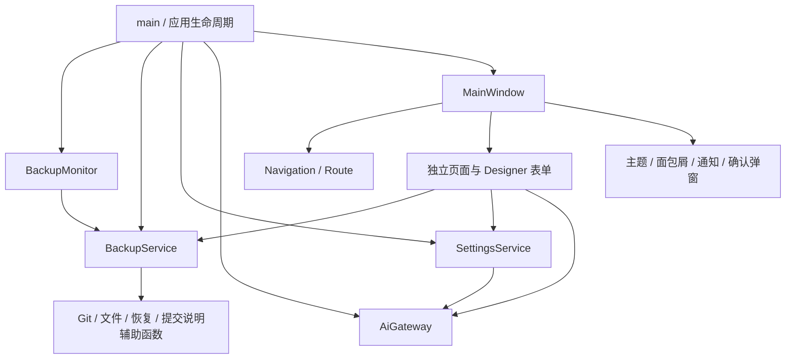

# UI 与服务边界

UI 基于 Qt 6.8.3、Qlementine v1.4.2 和原生窗口标题栏。每个页面都有独立的 Designer 表单。普通控件交由 `QlementineStyle` 绘制，标题、开关和折叠区域使用 Qlementine 的 `Label`、`Switch`、`Expander`。

## 文件职责

| 位置 | 职责 |
| --- | --- |
| `main.cpp` | 创建应用级服务和监控；处理既有命令行添加入口 |
| `ui/mainwindow.*` | 原生窗口、侧栏、页面装配、托盘、置顶和导航工具栏 |
| `ui/navigation.*` | `PageId / Route`、前进后退、清理已删除对象的所有导航记录 |
| `ui/pages/backupsPage.*` | 可滚动追踪卡片、空状态、添加文件/目录和云端导入入口 |
| `ui/pages/dashboardPage.*` | 路径与统计、远程设置、删除与重建确认 |
| `ui/pages/historyPage.*` | 持久版本模型、选中版本后的预览/恢复/对比、提交说明反馈 |
| `ui/pages/diffPage.*` | 持久文件模型、原始 Diff、独立 AI 分析、主题颜色 |
| `ui/pages/settingsPage.*` | 常规和 AI 两个独立页面类，各自拥有 `.ui` |
| `ui/pages/aboutPage.*` | 应用名称、图标和 CMake 应用版本 |
| `ui/components/presentation.*` | Qlementine 主题、SVG 图标、通知宿主、面包屑、标准确认对话框 |
| `services/backupservice.*` | 添加、备份、查询、预览、恢复、远程同步、导入、删除与重建 |
| `services/backupmonitor.*` | 应用级扫描定时器、按备份 ID 保存指纹与重入状态 |
| `services/settingsservice.*` | 配置迁移、即时保存、模型请求、平台集成设置 |
| `services/aigateway.*` | 可替换的 AI 传输边界；统一超时和单次完成回调 |
| `services/apppaths.h` | 唯一默认路径定义，支持临时测试路径注入 |
| `utils/` | 保留的文件、恢复及 AI 配置/提示词辅助逻辑 |

## 约束

- 服务不接受 `QWidget`，通过 `OperationResult` 和信号返回结果。通知保留信息、成功、警告、错误四级及显示时长。
- 页面通过明确的路由 ID 和信号请求导航。文件名、中文文案、父对象层级、堆叠控件索引都不是业务标识。
- `BackupMonitor` 属于应用。重建卡片、刷新列表、切换页面不重建监控状态。仍每 1.5 秒扫描一次，保持原来的大小/修改时间指纹以及 `.git`、`build` 过滤规则。
- 历史和 Diff 模型初始化一次。更新数据时向视图保留模型的结构变化信号；仅阻止编辑回调，编辑完成后再刷新。
- AI 模型请求绑定服务商和请求代次；修改 Key、URL 或切换服务商会使旧请求失效。Diff 请求同时绑定页面代次、备份 ID 和仓库代次。
- 同步 AI 提交说明沿用原来的 15 秒等待与回退策略。等待期间删除、重新添加或重建仓库，旧请求不能继续提交。
- 删除、重建确认捕获明确对象及其代次。导航中的已删除对象全部失效，同名文件相互独立。
- 回填控件状态不保存配置。折叠远程配置只改变展示状态；远程开关控制地址配置的存在与否。
- 添加文件和命令行添加都调用 `BackupService::addLocal`。UI 直接接收结果并刷新；不再额外启动一个相同应用进程来完成 UI 添加。

## 本轮不改动的业务规则

默认数据位置仍为系统“文档”目录下的 `ZcVersionBox/Backup` 和 `ZcVersionBox/config.ini`。备份 ID 仍为源路径的 URL 百分号编码，仓库结构和配置键名保持兼容。命令行仍只处理第一个非程序名参数。

Git 和文件操作继续同步执行，未引入任务队列或新的备份调度器。恢复继续使用原有的 `BackupRestoreHelper`。AI 提示词及配置兼容规则沿用原实现。

以下既有 Git 限制单独保留，避免把历史策略变更混入 UI 迁移：

1. `git init` 使用当前 Git 默认分支；预览后返回 `master`，pull、push、重建后的强推也仍使用 `master`。默认分支不是 `master` 时仍可能失败，必须另行设计分支策略。
2. 历史列表使用短哈希，原编辑逻辑用完整 HEAD 哈希判断是否可编辑。因此列表中的编辑尝试仍显示“只能编辑最新的提交说明”，并回填原说明。本轮没有放宽 amend 或引入历史改写。
3. 自动备份仍按大小与修改时间识别变化；失败后仍沿用原指纹推进方式。此次没有添加重试、内容哈希或离线变更扫描机制。
4. 导入仍选择仓库首个非 `.git` 条目，目录导入合并到所选父目录下的条目名称；指定目标文件/目录仍按原逻辑覆盖。工作区名称改变不会改写旧提交内的路径。
5. 重建仍清除历史，保留当前快照及远程地址，并尝试强推 `master`；失败通过警告反馈。

本轮针对 Diff 展示采用 Git 的 NUL 分隔路径输出，避免中文、空格和重命名路径被转义后无法选中。该调整不修改仓库、提交或历史策略。
